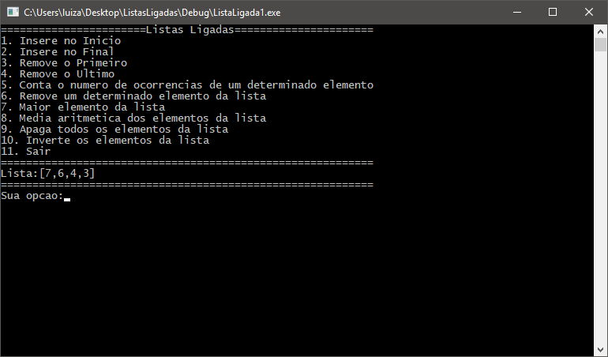

# Estrutura de Dados: Listas Ligadas

  Programa desenvolvido em C++ com o Visual Studio 2015 na disciplina de Estrutura de Dados II(3º Período) do curso de Ciência de Computação, como intuito de estudar a estrutura de lista ligada por ponteiros. 
  A princípio foi definida uma estrutura onde temos uma váriavel que armazena um número inteiro inteiro e um ponteiro que aponta para a próxima estrutura do mesmo tipo. Dessa forma, temos uma lista de elementos encadeados, cujo tamanho se ajusta de forma dinâmica, ao contrário do que se faz com arrays. 
  O programa possibilita a inserção de elementos tanto no início como no fim, além de uma série de outras opções como pode ser visto na captura de tela. 
  
Captura de tela: 

